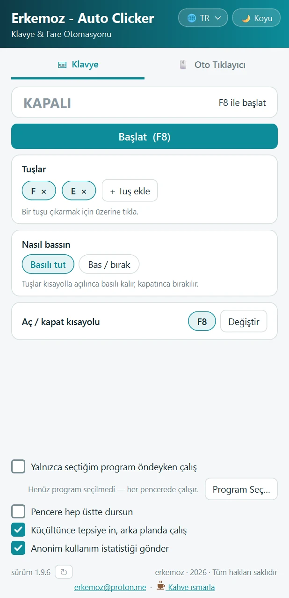
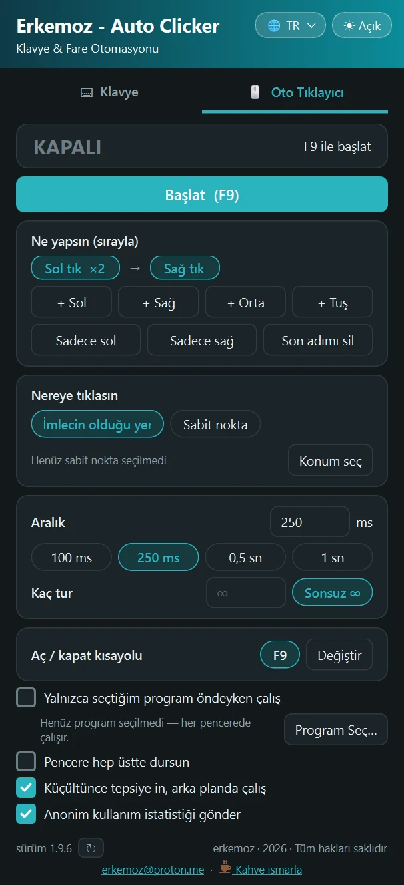

  

<h1 align="center">Erkemoz - Auto Clicker</h1>

  <b>Ücretsiz oto tıklayıcı ve tuş otomasyonu — Windows</b> 
  <i>Free auto clicker &amp; key automation for Windows</i>

  <a href="https://github.com/erkemoz-wq/erkemoz-auto-clicker/releases/latest"><b>⬇ Son sürümü indir · Download the latest version</b></a> 
  <code>ErkemozAutoClicker_Kurulum_x.y.z.exe</code> · Windows 10 / 11 (64-bit)
  🌐 <a href="https://erkemoz.app/auto-clicker/">erkemoz.app</a>

  
  &nbsp;&nbsp;
  

---

## Türkçe

### Neler yapar
- **Klavye:** Seçtiğin tuşları basılı tutar ya da istediğin aralıkla, istediğin kadar (ya da sonsuz) basıp bırakır.
- **Oto tıklayıcı:** Sol, sağ ya da orta tık; istersen kendi kombon (Sol → Sağ → E …). İmlecin olduğu yere ya da seçtiğin sabit bir noktaya tıklar.
- Kısayolla açılıp kapanır, her pencerede çalışır. İstersen yalnız seçtiğin program öndeyken çalışır.
- Simge durumuna küçültünce saatin yanındaki tepside çalışmaya devam eder.
- 8 dil, açık ve koyu tema. Yeni sürüm çıkınca program haber verir ve tek tıkla güncellenir.

### Kurulum
1. Yukarıdaki bağlantıdan kurulum dosyasını indir ve çalıştır.
2. Windows **"Bilgisayarınız Windows tarafından korundu"** derse **Ek bilgi → Yine de çalıştır**'a tıkla. Program henüz ücretli bir kod imzalama sertifikasıyla imzalı olmadığı için bu uyarı çıkabilir.

### Gizlilik
Program, kaç bilgisayarda kurulu olduğunu saymak için yalnız **rastgele bir kurulum numarası, sürüm ve arayüz dili** gönderir. İsim, IP adresi, dosya, tuş veya tıklama bilgisi gönderilmez ve saklanmaz. Ana penceredeki **"Anonim kullanım istatistiği gönder"** kutusunu kapatırsan hiçbir şey gönderilmez.

### Bilmen gerekenler
- Yönetici olarak çalışan pencerelere (ör. Görev Yöneticisi) Windows tuş ve tık gönderilmesine izin vermez.
- Bazı çevrim içi oyunlar otomatik tıklamayı yasaklar. Kullandığın oyunun kurallarına uymak senin sorumluluğunda.
- Program makine koduna derlenir ve her açılışta kendi dosyalarının mührünü denetler; değiştirilmiş bir kopya açılmaz. **Yalnız bu sayfadaki resmi sürümü indir.**
- 🛡 Her sürüm yayınlanırken otomatik olarak **VirusTotal**'da taranır; raporun linki ve sonucu [sürüm notunda](https://github.com/erkemoz-wq/erkemoz-auto-clicker/releases/latest) yazar. Bazen yapay zekâ tahminiyle tarayan tek tük bir motor imzasız programlara yanlış alarm verebilir.

---

## English

### Features
- **Keyboard:** Hold keys down, or press and release them at any interval, any number of times (or endlessly).
- **Auto clicker:** Left, right or middle click, or your own combo (Left → Right → E …), at the cursor or at a fixed point.
- Toggle with a hotkey. Works in every window, or only while a program you choose is in front.
- Keeps running in the system tray when minimized.
- 8 languages, light and dark theme. The app tells you when a new version is out and updates with one click.

### Installation
1. Download the installer from the link above and run it.
2. If Windows shows **"Windows protected your PC"**, click **More info → Run anyway**. This can appear because the app is not yet signed with a paid code-signing certificate.

### Privacy
To count how many computers it is installed on, the app sends only **a random install ID, the version and the interface language**. No name, IP address, files, keys or clicks are sent or stored. Uncheck **"Send anonymous usage statistics"** in the main window and nothing is sent.

### Good to know
- Windows does not allow sending keys or clicks to windows running as administrator (e.g. Task Manager).
- Some online games prohibit automated clicking. Following the rules of the game is your responsibility.
- The app is compiled to native code and verifies its own files on every start; a modified copy will not run. **Only download the official release from this page.**
- 🛡 Every release is automatically scanned on **VirusTotal**; the report link and result are in the [release notes](https://github.com/erkemoz-wq/erkemoz-auto-clicker/releases/latest). Occasionally a single ML-based engine may false-flag unsigned apps.

---

☕ Program işine yaradıysa / If it helps you: <a href="https://buymeacoffee.com/erkemoz"><b>Bana bir kahve ısmarla · Buy me a coffee</b></a>

© erkemoz · <a href="mailto:erkemoz@proton.me">erkemoz@proton.me</a> · Ücretsizdir / Free to use · Değiştirilip dağıtılamaz / Do not modify or redistribute

